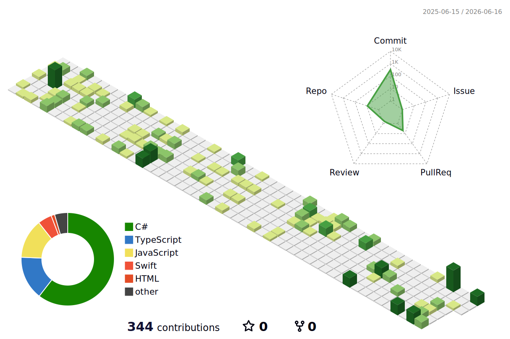

[Portfolio](YOUR_PORTFOLIO_URL) | [LinkedIn](https://www.linkedin.com/in/eduardo-rangel-37ab10264/)

### 🛠 Tech Stack

| **Frontend & Design** | **Backend & Cloud** |
| :---: | :---: |
|    |     |

 

| **Game Dev** |
| :---: |
|   |

