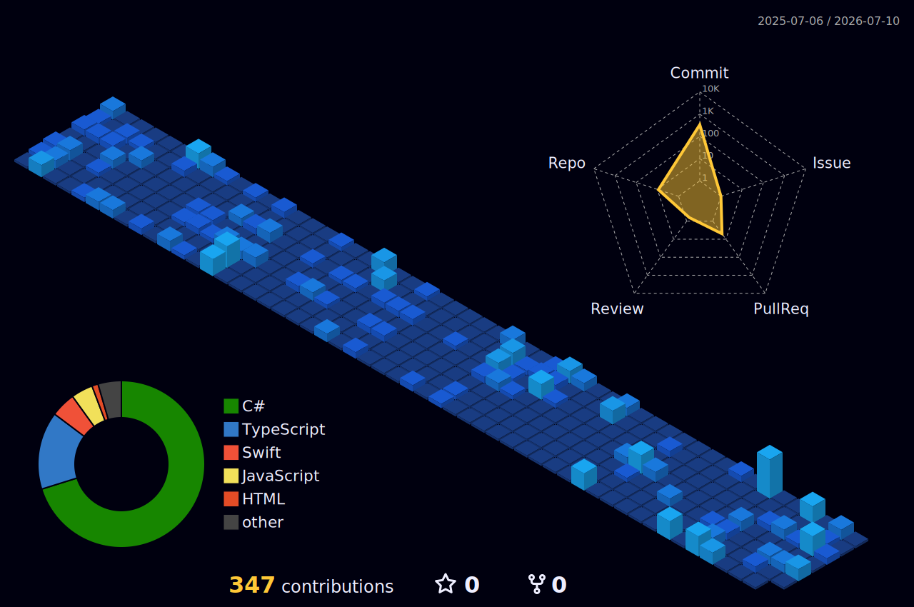

<h1>SOFTWARE ENGINEER | GAME UI DEV</h1>

  
  &nbsp;&nbsp;&nbsp;
  

### 🚀 Main Projects

#### Team Mage Studio Game Systems and UI

* **Technologies:** C#, Unity, TypeScript, React.
* **Architecture:** Developed a scalable game architecture utilizing State Machines and Observer Patterns. As well as, a reliable state management system for player data and save states.
* **Design:** Designed and developed custom in-game UI, menu systems, and synchronized visual/audio effects. Additionally, designed and deployed the official studio landing page to increase visibility.

#### Full-Stack Internship Applications

* **Technologies:** TypeScript, React, Tailwind, Java Spring Boot, PostgreSQL, Flyway, AWS.
* **Architecture:** Built applications providing real-time metrics, filtering, and data visualization. Managed PostgreSQL schema migrations with Flyway for expanding backend services.
* **Development Practices:** Leveraged Gemini CLI for agentic development to efficiently scaffold features and unit tests.

#### Full-Stack Patient Management System

* **Technologies:** JavaScript, Node.js, Bootstrap, Google Cloud APIs.
* **Features:** Designed a system that significantly reduced manual patient search time. Implemented data standardization practices for Google Sheets to improve data reliability and efficiency.

---

### 🛠 Tech Stack

#### Frontend and Design

  
  
  
  

#### Backend and Cloud

  
  
  
  
  

#### Game Dev

  
  

---

